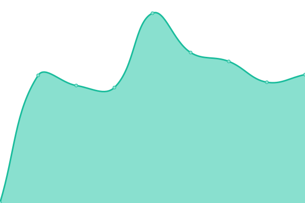
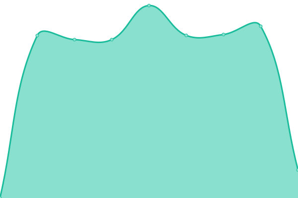

# [📈 Live Status](https://gdmad.github.io/status-check): <!--live status--> **🟧 Partial outage**

This repository contains the open-source uptime monitor and status page for [Evgeny Mishenko](https://gdmad.github.io/status-check), powered by [Upptime](https://github.com/upptime/upptime).

With [Upptime](https://upptime.js.org), you can get your own unlimited and free uptime monitor and status page, powered entirely by a GitHub repository. We use [Issues](https://github.com/gdmad/status-check/issues) as incident reports, [Actions](https://github.com/gdmad/status-check/actions) as uptime monitors, and [Pages](https://gdmad.github.io/status-check) for the status page.

<!--start: status pages-->
<!-- This summary is generated by Upptime (https://github.com/upptime/upptime) -->
<!-- Do not edit this manually, your changes will be overwritten -->
<!-- prettier-ignore -->
| URL | Status | History | Response Time | Uptime |
| --- | ------ | ------- | ------------- | ------ |
|  VRBS | 🟥 Down | [vrbs.yml](https://github.com/gdmad/status-check/commits/HEAD/history/vrbs.yml) | 

 3298ms
     
 | 

<a href="https://gdmad.github.io/status-check/history/vrbs">99.84%</a>
    

|  VRBT | 🟩 Up | [vrbt.yml](https://github.com/gdmad/status-check/commits/HEAD/history/vrbt.yml) | 

 1333ms
     
 | 

<a href="https://gdmad.github.io/status-check/history/vrbt">100.00%</a>
    

|  VRBG | 🟩 Up | [vrbg.yml](https://github.com/gdmad/status-check/commits/HEAD/history/vrbg.yml) | 

 1024ms
     
 | 

<a href="https://gdmad.github.io/status-check/history/vrbg">100.00%</a>
    

|  VRC | 🟩 Up | [vrc.yml](https://github.com/gdmad/status-check/commits/HEAD/history/vrc.yml) | 

 2109ms
     
 | 

<a href="https://gdmad.github.io/status-check/history/vrc">100.00%</a>
    

|  DZD | 🟩 Up | [dzd.yml](https://github.com/gdmad/status-check/commits/HEAD/history/dzd.yml) | 

 427ms
     
 | 

<a href="https://gdmad.github.io/status-check/history/dzd">100.00%</a>
    

<!--end: status pages-->

[**Visit our status website →**](https://gdmad.github.io/status-check)

## 📄 License

- Powered by: [Upptime](https://github.com/upptime/upptime)
- Code: [MIT](./LICENSE) © [Evgeny Mishenko](https://gdmad.github.io/status-check)
- Data in the `./history` directory: [Open Database License](https://opendatacommons.org/licenses/odbl/1-0/)
